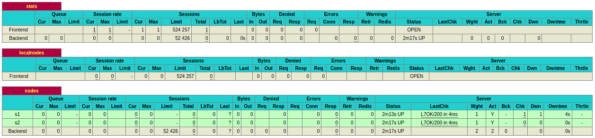
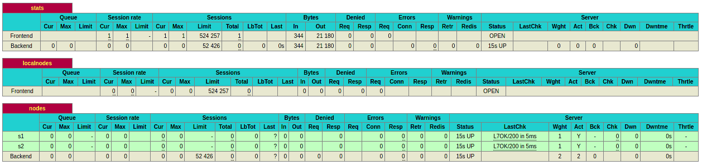

# Lab 4 - Report

> Authors: Gil Balsiger & Julien Béguin  
> Date: 02.12.2020

## Task 0: Identify issues and install the tools

### Questions

1. **[M1]**: 
1. **[M2]**: In this configuration, if we want to add a new backend node, we first need to start a new webapp container with its own name and IP. Then we need to modify the HAProxy configuration to add our new backend node. Finally, we need to reload HAProxy for it to take into account the new configuration. This
1. **[M3]**: 
1. **[M4]**: We need a service that is capable of telling us which backend node is up at any time. This can be archived by a service discovery tool like Consul that will update the HAProxy config whenever a backend node join or leave the pool.
1. **[M5]**: 
1. **[M6]**: If we add more server nodes, we still have the modify the HAProxy configuration to add more `sed` lines. This is not dynamic at all. We need to be able to loop into the list of node and print the configuration for each node. This can be archived with a template engine.

### Deliverables

> 1\. Take a screenshot of the stats page of HAProxy at http://192.168.42.42:1936. You should see your backend nodes.



> 2\. Give the URL of your repository URL in the lab report.

https://github.com/balsigergil/Teaching-HEIGVD-AIT-2020-Labo-Docker forked from https://github.com/SoftEng-HEIGVD/Teaching-HEIGVD-AIT-2020-Labo-Docker

## Task 1: Add a process supervisor to run several processes

### Deliverables

> 1\. Take a screenshot of the stats page of HAProxy at http://192.168.42.42:1936. You should see your backend nodes. It should be really similar to the screenshot of the previous task.



> 2\. Describe your difficulties for this task and your understanding of what is happening during this task. Explain in your own words why are we installing a process supervisor. Do not hesitate to do more research and to find more articles on that topic to illustrate the problem.

TODO


## Task 2: Add a tool to manage membership in the web server cluster

> Anyway, in our current solution, there is kind of misconception around the way we create the `Serf` cluster. In the deliverables, describe which problem exists with the current solution based on the previous explanations and remarks. Propose a solution to solve the issue.

### Deliverables

> 1. Provide the docker log output for each of the containers: `ha`, `s1` and `s2`. You need to create a folder `logs` in your repository to store the files separately from the lab report. For each lab task create a folder and name it using the task number. No need to create a folder when there are no logs.
>
>    Example:
>
>    ```
>    |-- root folder
>      |-- logs
>        |-- task 1
>        |-- task 3
>        |-- ...
>    ```

TODO

> 2. Give the answer to the question about the existing problem with the current solution.

Pas de problèmes lol TODO

> 3. Give an explanation on how `Serf` is working. Read the official website to get more details about the `GOSSIP` protocol used in `Serf`. Try to find other solutions that can be used to solve similar situations where we need some auto-discovery mechanism.

TODO

## Task 3: React to membership changes

**Deliverables**:

> 1. Provide the docker log output for each of the containers: `ha`, `s1` and `s2`. Put your logs in the `logs` directory you created in the previous task.

See files `1-ha.logs  2-s1.logs  3-ha-after-s1-started.logs  4-s2.logs` in `logs/task3/`

> 2. Provide the logs from the `ha` container gathered directly from the `/var/log/serf.log` file present in the container. Put the logs in the `logs` directory in your repo.

See file `5-ha-serf.log` in `logs/task3/`


## Task 4: Use a template engine to easily generate configuration files

**Deliverables**:

> 1. You probably noticed when we added `xz-utils`, we have to rebuild the whole image which took some time. What can we do to mitigate that? Take a look at the Docker documentation on [image layers](https://docs.docker.com/engine/userguide/storagedriver/imagesandcontainers/#images-and-layers). Tell us about the pros and cons to merge as much as possible of the command. In other words, compare:
>
> ```
> RUN command 1
> RUN command 2
> RUN command 3
> ```
>
> vs.
>
> ```
> RUN command 1 && command 2 && command 3
> ```
>
> There are also some articles about techniques to reduce the image size. Try to find them. They are talking about `squashing` or `flattening` images.
>
> 2. Propose a different approach to architecture our images to be able to reuse as much as possible what we have done. Your proposition should also try to avoid as much as possible repetitions between your images.
>
> 3. Provide the `/tmp/haproxy.cfg` file generated in the `ha` container after each step. Place the output into the `logs` folder like you already did for the Docker logs in the previous tasks. Three files are expected.
>
>    In addition, provide a log file containing the output of the `docker ps` console and another file (per container) with `docker inspect <container>`. Four files are expected.
>
> 4. Based on the three output files you have collected, what can you say about the way we generate it? What is the problem if any?


### Task 5: Generate a new load balancer configuration when membership changes

TODO

> 4. (Optional:) Propose a different approach to manage the list of backend nodes. You do not need to implement it. You can also propose your own tools or the ones you discovered online. In that case, do not forget to cite your references.

We can use a tool called [Consul](https://www.consul.io/) by [HashiCorp](https://www.hashicorp.com/). It can be used for service discovery and manage a list of backend nodes with applications running on them and performs health checks to keep the list up to date with alive nodes. It can be also used for load balancing between backend nodes. HAProxy configuration can also be generated from Consul with [consul-template](https://github.com/hashicorp/consul-template) instead of self made script. Consul also uses Serf for p2p networking and [gossip protocol](https://www.consul.io/docs/architecture/gossip).

### Task 6: Make the load balancer automatically reload the new configuration

> 1. Take a screenshots of the HAProxy stat page showing more than 2 web applications running. Additional screenshots are welcome to see a sequence of experimentations like shutting down a node and starting more nodes.
>
>    Also provide the output of `docker ps` in a log file. At least one file is expected. You can provide one output per step of your experimentation according to your screenshots.

We started the infrastructure with 3 nodes (01a) then stopped 2 nodes (01b) and finally restarted 1 node (01c). See files in `logs/task6/`. 

> 2. Give your own feelings about the final solution. Propose improvements or ways to do the things differently. If any, provide references to your readings for the improvements.

HAProxy seems pretty reactive when we add or remove a node. The current configuration is working fine if we only need a small number of nodes. 

However, our configuration become limited if we need a large amount of node (>20). The problem is due to the configuration of the container orchestrator (docker-compose) because we hardcoded the node. 

We can solve this problem by defining only one node on the docker-compose.yml and adding a `replicas` value :

```
services :
  webapp:
    deploy:
      replicas: 20
```

 Then, we can start our infra with :

```
docker-compose --compatibility up -d
```

And scale as we want the number of nodes :

```
docker-compose --compatibility up -d --scale webapp=15
docker-compose --compatibility up -d --scale webapp=25
docker-compose --compatibility up -d --scale webapp=8
```

> Reference : https://docs.docker.com/compose/compose-file/compose-file-v3/#replicas
>
> Example of utilization : https://github.com/balsigergil/RES-HTTPInfra/tree/step8_dynamic_cluster_mgmt#step-8--dynamic-cluster-management